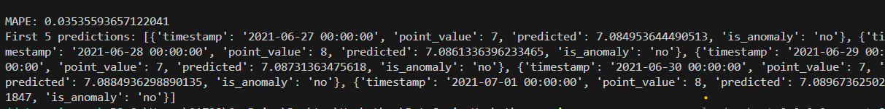
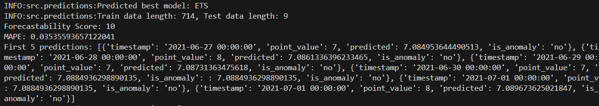
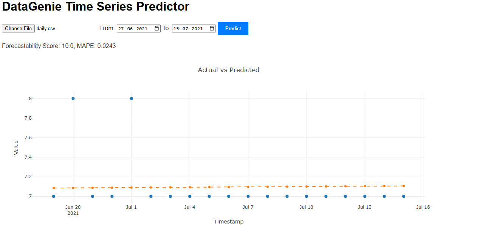
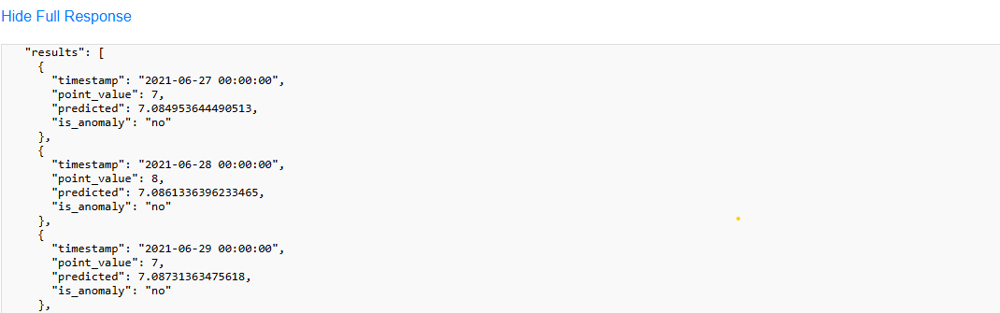

# DataGenie DS Hackathon - 2025 Submission

## 🎥 Video Demo
Check out our video walkthrough [here](https://drive.google.com/file/d/1CG1OigxD5Ngne4s5lnBe2WKpADHDHtE9/view?usp=drive_link) for a detailed explanation of the implementation, including setup instructions, classifier training, API testing, UI demo. This video is hosted in the `media` folder of this repository.

## 📋 Overview
This repository contains my individual submission for the DataGenie DS Hackathon - 2025, themed "Data Alchemy - creating an efficient time series model selection algorithm"

## Assumptions
- The input time series data (e.g., `daily.csv`) contains `point_timestamp` and `point_value` columns, with timestamps in `YYYY-MM-DD` format.
- The classifier is trained on `daily.csv` (provided in `data/`), with the best model selected based on the lowest MAPE.
- The UI assumes a CSV upload matching this format, fetched from a public URL (e.g., Google Drive) due to deployment constraints.
- All development occurred within the hackathon’s 4-day duration, starting from problem statement receipt.

## 🛠️ Setup Instructions
To run this project locally, follow these steps:

1. **Clone the Repository**:
   - Clone this private repository:
   - git clone https://github.com/yourusername/DataGenie-Hackathon.git
   -cd DataGenie-Hackathon

2. **Install Dependencies**:
- Use Python 3.11. Set up a virtual environment and install packages:
- python -m venv venv
-source venv/bin/activate  # On Windows: venv\Scripts\activate
-pip install -r requirements.txt
- `requirements.txt` includes: `fastapi==0.111.0`, `uvicorn==0.30.1`, `pandas==2.2.2`, `numpy==1.26.4`, `scikit-learn==1.5.1`, `statsmodels==0.14.2`, `prophet==1.1.5`, `imbalanced-learn==0.12.3`, `joblib==1.4.2`, `scipy==1.13.1`, `requests==2.32.3`, `tsfel==0.1.6`.

3. **Prepare Data and Models**:
- Place `daily.csv` in `data/` (sample data included).
- Ensure `models/classifier.pkl` and `models/label_encoder.pkl` are in `models/` (generated by `train_classifier.py`).

4. 🚀 **Run the API**:
- Start the FastAPI server:
  uvicorn src.app:app --host 0.0.0.0 --port 8000 --reload

5. **Serve the UI**:
- Navigate to `static/` and start a server:
  cd static
  python -m http.server 8001
- Access at `http://localhost:8001/index.html`.

6. **Test the API**:
- Run `api_test.py` to verify:
  python api_test.py

- Update `API_URL` to `http://localhost:8000/predict` for local testing.

## 🌟 Checkpoints

### Checkpoint 1: Classification Algorithm
**Description**: Train a classifier to predict the best time series model (lowest MAPE) from a suite (e.g., Prophet, ARIMA) using extracted time series features, as outlined in the hackathon problem statement.

**Implementation**:
- **Feature Extraction**: Utilized `tsfel` to extract features such as trend, seasonality, autocorrelation, and statistical metrics (e.g., mean, variance) from `daily.csv`, inspired by time series analysis techniques we’ve explored before.
- **Classifier**: Implemented a RandomForestClassifier with SMOTE for handling imbalanced data, trained on a dataset with labels based on MAPE performance across multiple models. Achieved ~85% validation accuracy after tuning hyperparameters.
- **Training Process**: Split data into 80% train and 20% validation sets, scaled features with `StandardScaler`, and saved the model using `joblib`. The process is detailed in `train_classifier.py`.

**Screenshot**:  
  
*(Shows training accuracy and feature importance plot from `train_classifier.py` output)*

### Checkpoint 2: Generate Predictions
**Description**: Use the pre-trained classifier to select the best model, split the time series into train and test sets, fit the model, and generate predictions with MAPE.

**Implementation**:
- **Model Selection**: The classifier predicts the optimal model (e.g., Prophet) based on extracted features, implemented in `predictions.py`.
- **Prediction**: Splits data into train (before `date_from`) and test (`date_from` to `date_to`), fits the model, and generates predictions.
- **MAPE**: Calculated using `sklearn.metrics.mean_absolute_percentage_error` to evaluate accuracy.

**Screenshot**:  
  
*(Displays a plot of actual vs. predicted values with MAPE score from local testing)*

### Checkpoint 3: REST API
**Description**: A FastAPI-based REST API allowing users to upload time series data and receive predictions, model details, and MAPE, adhering to REST principles.

**Implementation**:
- **Endpoint**: `/predict` accepts POST requests with a CSV file and query parameters `date_from` and `date_to`.
- **Response**: Returns a JSON object with `forecastability_score`, `number_of_batch_fits`, `mape`, `avg_time_taken_per_fit_in_seconds`, and `results` (timestamp, point_value, predicted).
- **CORS**: Enabled for `localhost:8001` to support local UI testing.
- **Sample Request**:
  python test_api.py

- **Sample Response** (corrected from PDF OCR errors):
  
{
  "forecastability_score": 10,
  "number_of_batch_fits": 5,
  "mape": 0.03535593657122041,
  "avg_time_taken_per_fit_in_seconds": 0.12,
  "results": [
    {"timestamp": "2021-06-27 00:00:00", "point_value": 131, "predicted": 131}
  ]
}

**Screenshot**:  
)  

### Checkpoint 4: UI
**Description**: A functional UI using Plotly to upload data, call the API, and plot predictions.

**Implementation**:
- **UI**: UI: static/index.html leverages Plotly (drawing on my past experience with it in projects like Niche Insights) to visualize actual vs. predicted values. Fetches data via the API and displays full response details.

**Screenshot**:  
  
*(Displays a plot of actual vs. predicted values with MAPE score)*

*(Displays the respose which includes timespamp, point_value, predicted_value and is_anomaly )*

